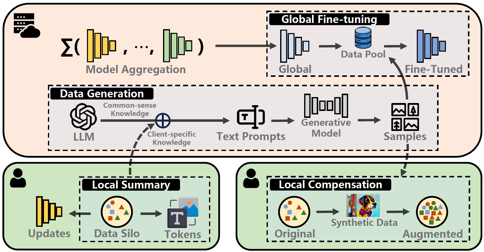

<h1 align="center">Flick: Empowering Federated Learning with Commonsense Knowledge</h1>

<p align="center">
  <a href="https://neurips.cc/virtual/2025/poster/119680"></a>
  
</p>

This repository provides the official implementation of [**Flick: Empowering Federated Learning with Commonsense Knowledge**](https://neurips.cc/virtual/2025/loc/san-diego/poster/119680) — accepted to **NeurIPS 2025**.


## Introductionx
Federated Learning (FL) has emerged as a privacy-preserving framework for training models on data generated at the edge. 
However, the heterogeneity of data silos (e.g., label skew and domain shift) often leads to inconsistent learning objectives and suboptimal model performance. 
Inspired by the data-driven approach, we propose Flick, a novel data generation framework for heterogeneous **F**ederated **L**earning w**i**th **C**ommonsense **K**nowledge from Large Language Models (LLMs). 
In Flick, the client performs the local data summary to capture client-specific knowledge in textual form. The central server then distills task-relevant, high-quality knowledge from the out-of-the-box LLM - guided by cross-client-specific insights - to generate informative text prompts. 
These prompts direct a generative model in producing synthetic data, enabling global model fine-tuning and local data compensation. 
This process gradually aligns the label and feature distributions across clients. 
Extensive results on three datasets demonstrate that Flick improves the global model accuracy by up to 11.43\%, and accelerates convergence by up to $12.9\times$, validating its effectiveness in addressing data heterogeneity.



## Dependencies
- Python 3.8.15
- Pytorch 2.2.1

Please install the required packages first by executing the command below:
```
pip install -r requirements.txt
```

## Data Preparation
For PACS, Office-Caltech and DomainNet datasets, please download and unzip data under `data/` file catalog. The dataset folders should be named `PACS` and `office_caltech_10`, respectively.
```
data/
|–– PACS/ 
|–– office_caltech_10/
|–– domainnet/
```

## How to run

To train the model using Flick proposed in this paper, run the command **using your own openai api key**:
```
python main.py -c conf.json
```

## Training Parameters
In [conf.json](./utils/conf.json), you can change the hyper-parameters and some settings. 

* Here we give the detailed 
description for each parameter defined in [conf.json](./utils/conf.json):

| Parameter                | Description                                                                                 |
|--------------------------|---------------------------------------------------------------------------------------------|
| ` openai_api_key`        | openai api key to use                                                                       |
| ` data`                  | dataset to use  [pcas/office-caltech/domainnet]                                             |
| ` data_distribution`     | data distribution of clients                                                                |
| ` num_clients`           | number of all clients                                                                       |
| ` k`                     | number of clients involved in each round                                                    |
| ` global_epochs`         | number of global epochs                                                                     |
| ` local_epochs`          | number of local epochs, defalut is 5                                                        |
| ` lr`                    | learning rate adopted in local training phase, default is 0.01                              |
| ` batch_size`            | batch size adopted in local training phase, default is 64 for PACS and 32 for Office-Caltch |
| ` retrieval_threshold`   | text similarity threshold $T_s$, default is 0.8 for PACS and 0.7 for Office-Caltch          |
| ` cls_eval_threshold`    | validation threshold $T_v$, default is 0.9 for PACS and 0.8 for Office-Caltch               |
| ` size_of_data_pool`     | data pool size, default is 25                                                               |
| ` data_budget`           | data generation budget $G$, default is 5                                                    |
| ` data_generation`       | way of data generation [diffusion model(df)/ dall-e-2], default is df                       |

[//]: # (| ` cap_dp`               | if apply epsilon-differential privacy                                                       |)

[//]: # (| ` cap_dp_ratio`         | value of epsilon                                                                            |)


## Citation

If Flick is useful for your research, please consider citing it:

```
@inproceedings{
zhu2025flick,
title={Flick: Empowering Federated Learning with Commonsense Knowledge},
author={Ran Zhu and Mingkun Yang and Shiqiang Wang and Jie Yang and Qing Wang},
booktitle={The Thirty-ninth Annual Conference on Neural Information Processing Systems},
year={2025},
url={https://openreview.net/forum?id=7ieS4EYKnB}
}
```

## Contact
Feel free to contact authors or leave an issue if face with a problem when using this implementation.